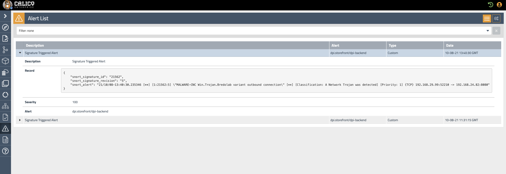

# Tigera-DPI

**Goal:** Configure Deep Packet Inspection (DPI) in clusters to get alerts on compromised resources.

Security teams need to run DPI quickly in response to unusual network traffic in clusters so they can identify potential threats. Also, it is critical to run DPI on select workloads (not all) to efficiently make use of cluster resources and minimize the impact of false positives. Calico Enterprise provides an easy way to perform DPI using Snort community rules. You can disable DPI at any time, selectively configure for namespaces and endpoints, and alerts are generated in the Alerts dashboard in Manager UI.

## Steps

1. Deploy environment

    ```bash
    # deploy Storefront Application 
    kubectl apply -f https://installer.calicocloud.io/storefront-demo.yaml
    # deploy rogue workload for testing purpose
    kubectl apply -f https://installer.calicocloud.io/rogue-demo.yaml
    ```
2. Create DeepPacketInspection resource, in this example we will enable DPI on backend pod in storefront namespace    

    ```bash
    cat <<EOF| kubectl apply -f -   
    apiVersion: projectcalico.org/v3
    kind: DeepPacketInspection
    metadata:
      name: dpi-backend
      namespace: storefront
    spec:
      selector: app == "backend"
    EOF
    ``` 
3. check that the "tigera-dpi" pods created successfully, it's a deaemonSet so one pod should created in each node
    
    ```bash
    kubectl get pods -n tigera-dpi
   ```
make sure that all pods are in running state

4. Trigger Snort rule from attacker pod to backend.storefront 

    ```bash
    kubectl exec -it $(kubectl get po -l app=attacker-app -ojsonpath='{.items[0].metadata.name}') -- sh -c "curl http://backend.storefront.svc.cluster.local:80 -H 'User-Agent: Mozilla/4.0' -XPOST --data-raw 'smk=1234'"
    ```
5. Now, go and check the Alerts page in the UI and you should see a signature triggered alert



6. Stop DeepPacketInspection

    ```bash
    kubectl delete DeepPacketInspection dpi-backend -n storefront 
    ```
    
